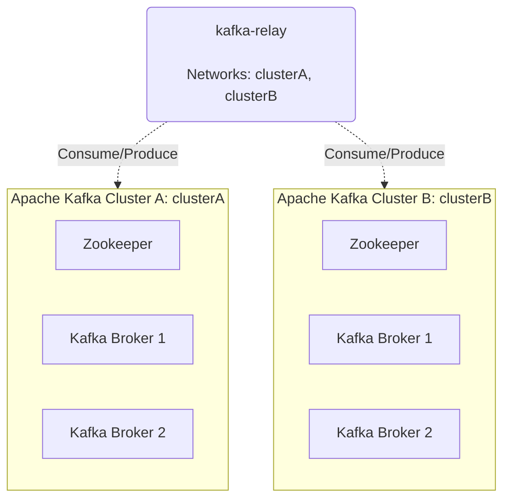
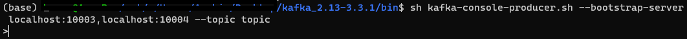
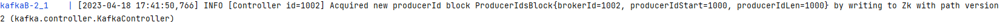
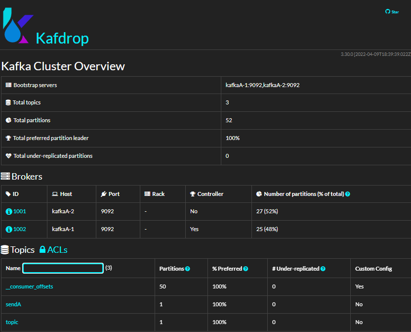
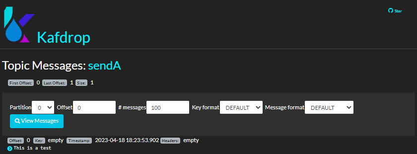
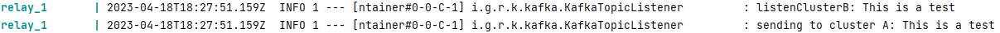
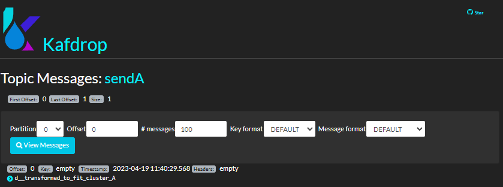

# kafka-relay-example

**kafka-relay-example** is a spring-boot application that reads messages 
from a kafka cluster and forwards it to another kafka cluster using the 
[kafka-relay](https://github.com/RomanosTrechlis/kafka-relay) package.

## Build

Build **kafka-relay-example** using gradle.

Run the command `gradlew build -Puser <user> -Pkey <GITHUB_PAT>`.

For this application we create a custom kafka message transformer that implements the `ITransformKafkaMessage`.
Additionally, we create a bean for this transformer.

```java
@Bean
public ITransformKafkaMessage transformer() {
    return new CustomKafkaMessageTransformer();
}
```

And we also add the annotation `@ComponentScan("io.github.romanostrechlis.kafkarelay")` in order to load the beans
define in the **kafka-relay** package.

## Deployment

**kafka-relay-example** is deployed by running `docker-compose up --build`.



Run the following command to produce a message to Cluster B.

```
 sh kafka-console-producer.sh --bootstrap-server localhost:10003,localhost:10004 --topic topicB
```

This creates a prompt to write the message:



And the following line in the kafka broker appears:



We then write a message to the prompt.

The relay listen to the topic and after transforming the message it sends it to
the other cluster. The new topic is created if it doesn't exist.



Navigating into kafdrop topic we can read the message.



We can also check the relay's logs.



In this Spring Boot application we implement a different transformer that adds a suffix to the message.



## Configuration

The following properties must be filled in order for the application to run correctly.

```properties
kafka.clusterA.bootstrapAddress=kafka-clusterA
kafka.clusterA.listen.topic=topic
kafka.clusterA.send.topic=sendA
kafka.clusterA.groupId=test
kafka.clusterB.bootstrapAddress=kafka-clusterB
kafka.clusterB.listen.topic=topic
kafka.clusterB.send.topic=sendB
kafka.clusterB.groupId=test
```

Reference also to [docker-compose.yml](docker-compose.yml)

